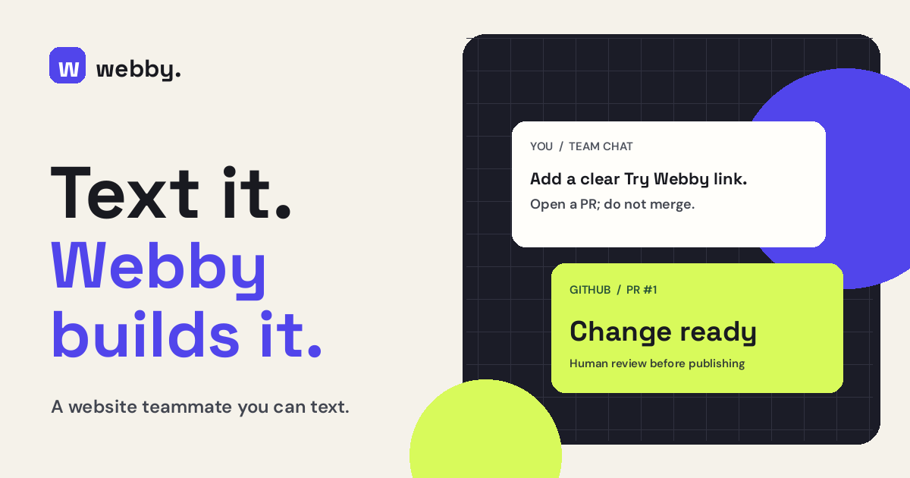
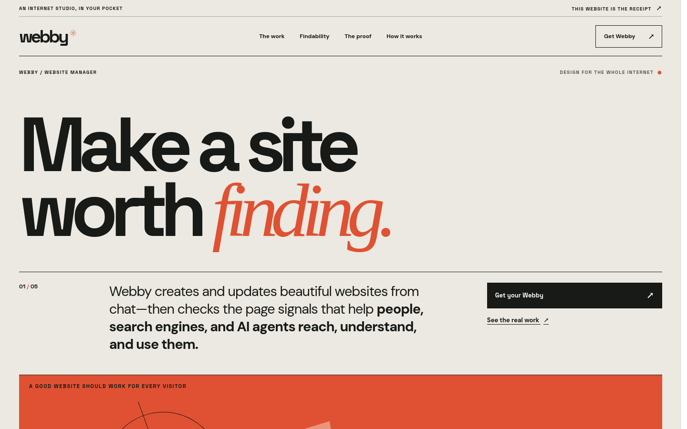

<p align="center">
  <a href="https://bubba311.github.io/webby-website-manager/"></a>
</p>

# Webby. Your website teammate.

**Built to win the agentic economy.**

Text your idea. Webby creates and updates a distinctive site, taking care of the readable structure, page details, links, and actions that help people, search engines, and AI agents find and use it. You do not need to learn those mechanics or write a separate brief. You decide what ships.

[Watch the 76-second real-work demo](https://github.com/bubba311/webby-website-manager/releases/tag/webby-demo-2026-09-26) · [Explore the website](https://bubba311.github.io/webby-website-manager/) · [See the real pull request](https://github.com/bubba311/webby-website-manager/pull/1) · [Get started](docs/GETTING_STARTED.md) · [Agent Index](https://aiworthusing.com/agent-index/webby-website-manager)

---

## One conversation. Three useful jobs.

**01 / CREATE** — Give Webby a short startup brief. It drafts a visually distinct, GitHub-backed site with clear pages and actions, then checks the draft before review.

**02 / UPDATE** — Ask for a new page, a sharper headline, or a launch detail. Webby makes the change on a branch and keeps the page understandable and usable.

**03 / CHECK** — Give Webby a live URL. It checks crawl access, readable content, and labeled controls, then shows the evidence and a practical fix.

For code changes, Webby opens a pull request. An audit starts with a report; Webby edits only when you ask it to. The owner reviews and publishes the work.

### The quiet work comes standard.

Webby considers the whole visitor path while it builds: a page with a meaningful title and description, visible answers to what the company does, links that lead somewhere real, and controls people can understand. It applies those details alongside a deliberate visual direction, readable type, responsive spacing, and useful interaction states. Its browser helper captures the actual page at phone, tablet, and desktop sizes for visual review.

For a published site, Webby separates whether a service can reach the page, understand its facts, use it as a source, and complete a visitor task. It shows evidence and fixes without a mystery score. Search citations require actual search observations; an accessible page or a successful reading test alone does not establish them. These principles are part of the normal workflow, so founders do not need a separate optimization brief.

### Your models. One coherent website.

Choose one writer for a whole site, or give different sections to different models—even within the same page. Webby supports Codex and Claude Code subscription connections, OpenAI, Anthropic and Gemini APIs, and configured OpenAI-compatible services. It collects bounded drafts, preserves a shared visual direction and voice, checks the assembled work, and returns one pull request. Connect each selected provider once; [the model guide](docs/MODEL_CHOICE.md) explains the available login routes and their limits.

You can also choose a reader model to check what the page communicates: the offer, audience, next action, and evidence. That checks understanding of supplied content; actual search discovery and citations require separate observations. The model receipt records what ran, what the provider reported, and any failure. No provider is silently substituted.

[PR #12](https://github.com/bubba311/webby-website-manager/pull/12) shows real Codex and Claude contributions to different sections of this site, followed by a reading check and editorial review. Screenshot reviews can use Webby's existing Plow vision connection or a selected, connected model; default visual review needs no extra sign-in.

## This is Webby's own website.



Webby made its first real change to the site in [`site/`](site/). [PR #1](https://github.com/bubba311/webby-website-manager/pull/1) contains that change and the create and check workflows. [PR #2](https://github.com/bubba311/webby-website-manager/pull/2) established the editorial direction; PR #12 adds the current positioning and model workflows. The public site deploys from `main` after a reviewed merge.

## Start with a text.

Once Webby is [installed and connected to GitHub](docs/GETTING_STARTED.md), send:

> Create a website for my startup. Ask me only for its name, what it does, and where the main button should go. Open a pull request for review; don't publish it yet.

Already have a site? Ask for a specific change. Want a check first? Send its approved public URL and ask Webby for the top three access and usability fixes. [The setup guide](docs/GETTING_STARTED.md) has the working cloud install and exact commands.

## What is in the repo?

| Path | Purpose |
| :--- | :--- |
| [`site/`](site/) | Webby's own responsive website. |
| [`starter-site/`](starter-site/) and [`skills/webby-create/`](skills/webby-create/) | A first site from a short brief, delivered for review. |
| [`skills/webby-github/`](skills/webby-github/) | GitHub connection, approved repositories, branches, and pull requests. |
| [`skills/webby-audit/`](skills/webby-audit/) and [`scripts/webby-site-audit`](scripts/webby-site-audit) | Read-only checks of a live site's access, content, and controls. |
| [`skills/webby-model-choice/`](skills/webby-model-choice/) and [`scripts/webby-model-draft`](scripts/webby-model-draft) | Model-selected section/file drafts and reader checks, with scoped patches and run receipts. |
| [`scripts/webby-render-check`](scripts/webby-render-check) | Phone/desktop screenshots and page observations for rendered review. |
| [`prompt/AGENTS.md`](prompt/AGENTS.md) | Webby's role and owner approval rules. |

The live-site check can also run without Webby:

```sh
python3 scripts/webby-site-audit https://your-public-site.example/
```

It reports observations and checks that need a browser or account access. It does not promise search placement. Crawler permissions stay an owner decision.

**Works with GitHub-backed websites today.** Wix, Webflow, and Framer integrations are planned. Webby does not claim to edit those builders yet.

<details>
<summary><strong>Build, run, and verify Webby locally</strong></summary>

The [setup and development guide](docs/GETTING_STARTED.md) covers Plow Chat, the pinned cloud image, Docker Compose, GitHub login, the image build, and verification. The code is [MIT licensed](LICENSE).

</details>
